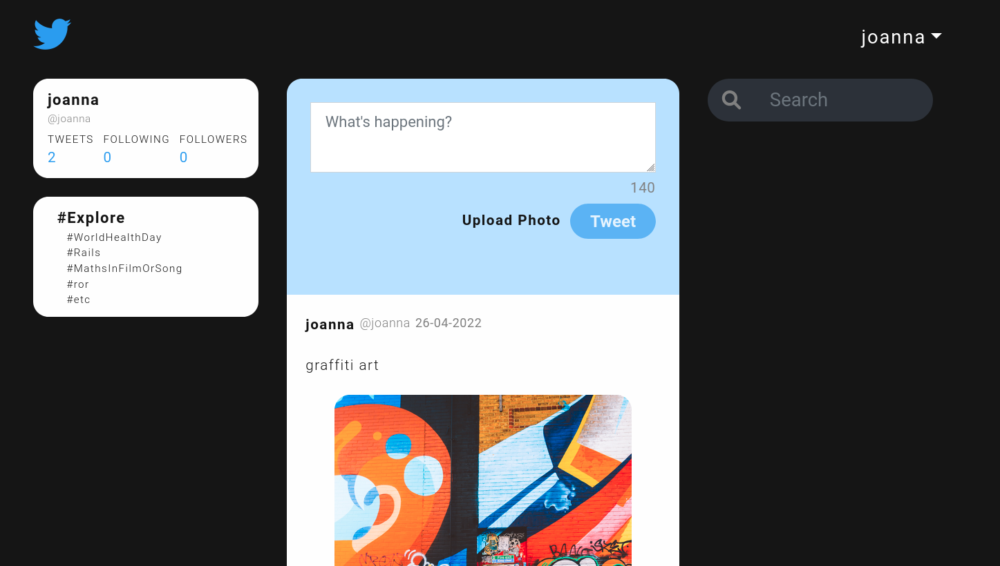

# Full Stack Twitter Clone

Check it out -> [full-stack-twitter-jr](https://fs-twitter-jr.herokuapp.com)
Built with **React**, **Ruby on Rails** and **Sass** as a full stack project during altcademy's web development course

## Features

* User creation/sign up and log in
* The user can post tweets to feed
* Tweets can include a photo upload (AWS storage)
* User authentication
* The user can end the session (log out)

## Versions

* Ruby 3.0.3
* Rails 6.1.5
* Node 12.22.0
* Webpacker 5.4.3
* Bootstrap 5